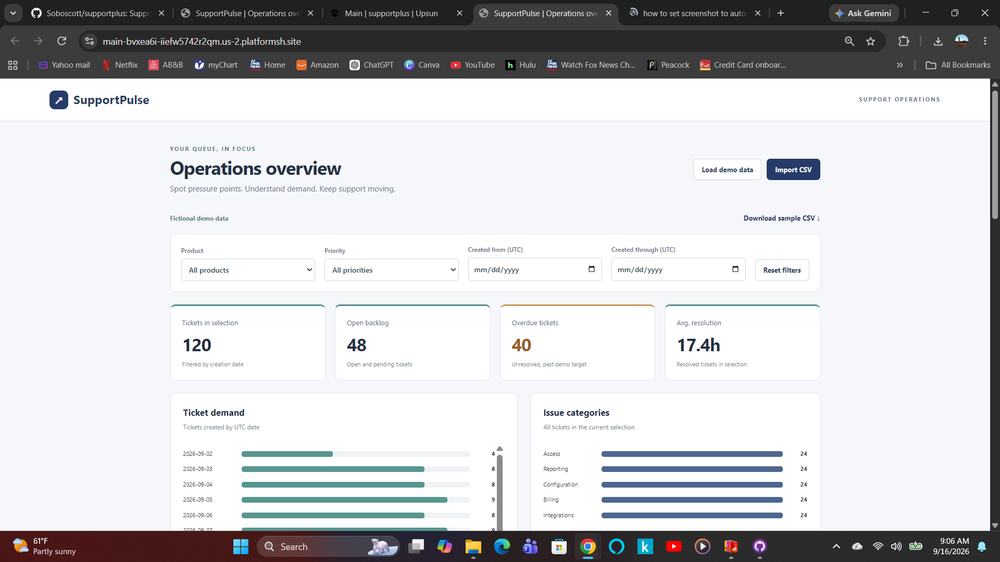

# SupportPulse

[Launch the live dashboard](https://main-bvxea6i-iiefw5742r2qm.us-2.platformsh.site/)



A support operations dashboard for exploring ticket demand, backlog,
aging, and resolution time. Try 120 fictional tickets or import the
included sample CSV. No login required.

## Why I built this

Drawing on my experience leading product support teams, I built
SupportPulse to explore questions support managers face every day:

- Where is ticket demand coming from?
- Which tickets need attention?
- How long are customers waiting for resolution?

This project connects support operations experience with hands-on
JavaScript development, data validation, GitHub, and deployment on Upsun.

## Features

- Ticket count, open backlog, overdue tickets, and average resolution time.
- Filters for product, priority, and ticket creation date.
- Ticket demand, issue category, and backlog aging charts.
- Searchable ticket table with pagination.
- Sample CSV download and validated CSV import.
- Responsive layout for desktop and mobile.
- ditable resolution targets by priority, with immediate overdue recalculation.

## Technology

HTML, CSS, JavaScript, and a Node.js server with no third-party
dependencies. Hosted on Upsun with GitHub-connected deployment.

## Run locally

Requires Node.js 22 or newer. Open a terminal in the repository folder:

```bash
npm start
```

Open http://localhost:3000.

Run the automated data and metric tests:

```bash
npm test
```

No dependency installation or build step is required.

## How the metrics work

Dashboard metrics use tickets matching the product, priority, and
creation-date filters. Search affects only the ticket table.

- Open backlog includes Open and Pending tickets.
- Overdue tickets exceed illustrative elapsed-time targets:
  Critical 4 hours, High 24 hours, Normal 72 hours, and Low 120 hours.
- Average resolution measures creation-to-resolution time for resolved
  tickets in the selection.
- Aging groups unresolved tickets into under 1 day, 1–3 days,
  3–7 days, and 7+ days.

These are demonstration targets, not business-hour SLAs. Date filters
select tickets by creation date; they do not show historical backlog.

## CSV import and privacy

Download the sample CSV from the dashboard to see the required format.
Imports support up to 10,000 tickets within a 5 MB file limit.

CSV files are processed in browser memory and are not uploaded.
Refreshing restores the fictional demo data.

## Project structure

- `index.html`: dashboard structure
- `src/styles.css`: layout and styling
- `src/app.js`: dashboard interactions
- `src/data.js`: demo data, CSV validation, and metrics
- `server.mjs`: Node.js web server
- `tests/data.test.js`: automated tests
- `.upsun/config.yaml`: deployment configuration

## Next milestones

- Configurable resolution targets.
- Prior-period comparisons with clearly defined date ranges.
- Dashboard screenshot and a short demonstration walkthrough.
- editable elapsed-time targets, with defaults of
